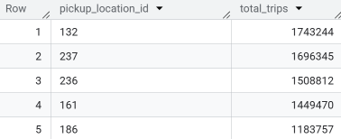
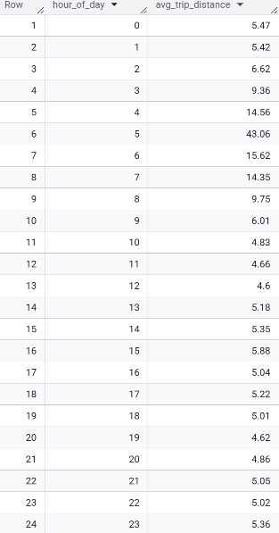
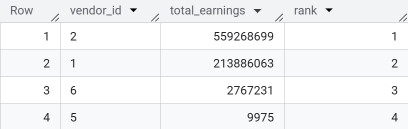

# SQL Test for Data Engineers
To complete the test below you’ll need to use Google BigQuery and the new_york_taxi_trips dataset. You must be capable of configuring a Google BigQuery free trial if you don’t have an account yet and finding the NYC TLC Trips dataset in the marketplace to move forward with the test.

**Instructions**:
1. Write SQL queries to perform the problems.
2. Ensure that your queries are efficient and utilize the appropriate BigQuery functions
and techniques.
3. Submit the SQL scripts along with any explanations or comments you think are
necessary to understand your approach.
4. You will need to use the table below to answer all tests:
bigquery-public-data.new_york_taxi_trips.tlc_yellow_trips_2022


## Problem 1: Analyzing Popular Pickup Locations

**Objective**: Identify the top 5 most popular pickup locations based on the total number of
trips. Provide the total number of trips for each of these locations.

**Instructions**:
- Use a Common Table Expression (CTE) to first calculate the number of trips for each
pickup location.
- Then, retrieve the top 5 locations by the number of trips.

**Expected Output**:
- pickup_location_id
- total_trips

**Query**:

```sql
WITH trips_per_pickup_location AS (
  SELECT
    pickup_location_id,
    count(pickup_location_id) AS total_trips
  FROM
    `bigquery-public-data.new_york_taxi_trips.tlc_yellow_trips_2022`
  GROUP BY
    pickup_location_id
)
SELECT
  *
FROM
  trips_per_pickup_location
ORDER BY
  total_trips DESC
LIMIT 5
```

**Output**:




## Problem 2: Calculating Average Trip Distance per Hour

**Objective**: Calculate the average trip distance for each hour of the day.

**Instructions**:
- Use a window function to calculate the average trip distance across all trips per hour.
- Ensure that the results are sorted by hour and the trip distance is rounded to 2 decimal places.

**Expected Output**:
- hour_of_day
- avg_trip_distance

**Query**:

```sql
SELECT
  EXTRACT(HOUR FROM pickup_datetime) AS hour_of_day,
  ROUND(AVG(trip_distance) OVER (PARTITION BY EXTRACT(HOUR FROM pickup_datetime)), 2) AS avg_trip_distance
FROM
  `bigquery-public-data`.new_york_taxi_trips.tlc_yellow_trips_2022
QUALIFY ROW_NUMBER() OVER (PARTITION BY EXTRACT(HOUR FROM pickup_datetime)
  ORDER BY NULL) = 1
ORDER BY hour_of_day;
```

**Output**:




## Problem 3: Identifying the Top Earning Vendors

**Objective**: Identify the top 10 vendors who earned the most in total fares.

**Instructions**:
- Use a CTE to aggregate the total amount made by the vendor.
- Use an efficient join to link trip data with vendor IDs.
- Calculate the total earnings for each vendor and rank them using a window function.

**Expected Output**:
- vendor_id
- total_amount
- rank

**Query**:

```sql
WITH
  VendorEarnings AS (
    SELECT
      vendor_id,
      SUM(total_amount) AS total_earnings
    FROM
      `bigquery-public-data`.new_york_taxi_trips.tlc_yellow_trips_2022
    GROUP BY vendor_id
  )
SELECT
  vendor_id,
  ROUND(total_earnings) AS total_earnings,
  DENSE_RANK() OVER (ORDER BY total_earnings DESC) AS rank
FROM
  VendorEarnings
ORDER BY total_earnings DESC
LIMIT 10;
```

**Output**:

